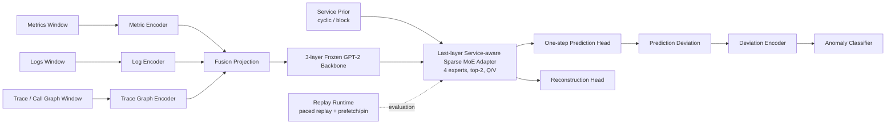

# RTSS 论文梳理

## 1. 当前定位

- 投稿主线：`RTSS`
- 问题定义：在**多模态异常检测**场景下，同时优化
  - 检测效果
  - deadline miss
  - tail latency
  - 推理路径稳定性
- 当前最合适的主模型：`service-aware MoE (stage-2)`
- 当前最重要的对照基线：`V6-3layer raw`
- 当前不作为最终主线的方法：
  - `RTSS-MoE P0/P1-sticky`
  - `V6-cache`
  - `V6-3+fallback-6`

一句话版本：

> 我们现在最适合讲的 RTSS 故事，不是“MoE 提高了 F1”，而是“在多模态 TSFM 主干上，用 service-aware sparse routing 把 deadline miss、tail latency 和 routing stability 做得更可控”。

---

## 2. 模型架构

### 2.1 基础主干

当前 RTSS 主线仍然建立在 `V6-3layer raw` 的骨架上：

- 三模态输入：`metrics / logs / traces`
- 三个模态编码器：
  - `Metric Encoder`
  - `Log Encoder`
  - `Trace Graph Encoder`
- 融合后送入**冻结 GPT-2 时序主干**
- 采用 `3-layer GPT-2`，而不是原始 `6-layer`
- 通过“下一时刻预测偏差”构造异常信号，再做分类

### 2.2 RTSS 主线新增模块

相对 `V6-3layer raw`，当前 RTSS 主线新增的是：

- `service-aware sparse MoE adapters`
- 固定预算路由：`topk=2`
- 仅在最后 `1` 层 GPT-2 上挂载 MoE adapter
- 当前默认只改 `Q/V` 相关投影：`moe_target=qv`
- `service prior`
  - 当前主配置：`cyclic`
  - 当前主强度：`0.75`
- 路由诊断指标：
  - `effective_experts`
  - `route_switch_rate`
  - `dominant_top1_share`

### 2.3 论文架构图草案



### 2.4 画图时建议突出什么

如果后面要正式出论文图，建议把颜色重点放在下面 4 个部件：

1. `3-layer frozen GPT-2 backbone`
2. `service-aware sparse MoE adapter`
3. `fixed top-2 routing`
4. `runtime replay / deadline evaluation`

这样评审一眼就能看出：

- 你们不是重新发明整个 backbone
- 你们的贡献集中在“**稳定、可预测的 sparse routing**”
- 方法与 RTSS 指标是成体系绑定的

### 2.5 当前默认配置

| 模块 | 当前主配置 | 说明 |
|------|------------|------|
| backbone | `V6-3layer raw` | 相比原始 `6-layer` 更轻、更稳 |
| GPT-2 层数 | `3` | 当前 realtime 骨架 |
| 模态 | `metrics + logs + traces` | 标准三模态 |
| trace encoder | `GAT` | 附录中有 `no_graph` 消融 |
| MoE experts | `4` | 当前主配置 |
| router top-k | `2` | 固定预算 sparse routing |
| adapter rank | `4` | 轻量 LoRA-style expert |
| adapter alpha | `8.0` | 当前默认 |
| adapter dropout | `0.05` | 当前默认 |
| adapter target | `qv` | 只改注意力相关投影 |
| adapter layers | `1` | 仅最后一层挂载 |
| router hidden | `64` | 当前默认 |
| router temp | `0.7` | 当前默认 |
| service prior mode | `cyclic` | 当前双数据集更一致 |
| service prior strength | `0.75` | 当前综合最优点 |

### 2.6 当前训练目标

当前主结果对应的目标函数可以写成：

```text
L_total = L_MSTGAD + lambda_pred * L_pred + lambda_bal * L_bal
```

其中：

- `L_MSTGAD`
  - 异常分类损失
  - 重构误差相关损失
- `L_pred`
  - 下一时刻预测损失
- `L_bal`
  - expert balance loss，防止路由塌缩

说明：

- `latency-aware cost loss`
- `switch / sticky loss`

这两类更强 RTSS 约束，已经在 `RTSS-MoE P0/P1` 原型里做过骨架与探测，但**当前最终主结果不是靠它们收口**，而是靠 `service-aware sparse routing + runtime co-design` 收口。正文里要诚实区分这一点。

---

## 3. 创新点梳理

### 3.1 主创新点

| 级别 | 创新点 | 核心意思 | 当前证据 |
|------|--------|----------|----------|
| 主 | `service-aware sparse routing` | 在多模态 TSFM 上引入带服务先验的固定预算 MoE 路由，不再是完全自由路由 | `no-service-prior`、`strength`、`cyclic/block` 消融都已完成 |
| 主 | `deadline / stability-oriented evaluation protocol` | 不只看 `F1`，还系统报告 `miss@deadline`、`p99/max`、stress replay、routing diagnostics | 双数据集 replay、多 seed、统一 deadline stress 已完成 |
| 主 | `routing stability as first-class evidence` | 用 `effective_experts / route_switch_rate / dominant_top1_share` 描述路径稳定性 | 已有 routing diagnostics 和多 seed 汇总 |

### 3.2 次创新点

| 级别 | 创新点 | 核心意思 | 当前证据 |
|------|--------|----------|----------|
| 次 | `3-layer backbone` | 用更轻的时序主干作为 RTSS 参考骨架，降低最坏时延与显存 | `6-layer raw vs 3-layer raw` 对比已完成 |
| 次 | `runtime co-design` | 通过 `prefetch / pin_memory / paced replay` 识别并压掉 runtime 侧瓶颈 | `no prefetch / prefetch / prefetch+pin` 消融已完成 |
| 次 | `multi-modal tradeoff analysis` | 不把“多模态都 equally important”讲满，而是分析各模态与图结构对实时性的影响 | `w/o metrics/logs/traces` 与图结构消融已完成 |

### 3.3 当前最稳妥的论文表述

建议正文把创新点收束成下面这句：

> 我们提出一种面向实时异常检测的 `service-aware sparse routing` 机制，在轻量化 TSFM 主干中显式约束专家选择路径，并结合 deadline-oriented replay 与 routing diagnostics，提升多模态模型的推理可预测性与尾部稳定性。

不要写成：

- “我们提出了全新的通用 MoE 框架”
- “我们给出严格 timing guarantee”
- “所有模态都同等关键”

这些说法目前都偏过。

---

## 4. 实验参考指标

| 指标 | 含义 | 趋势 | 在论文中的角色 |
|------|------|------|----------------|
| `F1` | 精确率与召回率调和平均 | 越高越好 | 异常检测主效果指标 |
| `Precision` | 预测异常中真正异常的比例 | 越高越好 | 辅助说明误报情况 |
| `Recall` | 真实异常被检出的比例 | 越高越好 | 辅助说明漏报情况 |
| `Accuracy` | 总体分类正确率 | 越高越好 | 辅助指标 |
| `miss@50/100/200ms` | 响应时间超过 deadline 的比例 | 越低越好 | RTSS 主指标 |
| `mean latency` | 平均响应时延 | 越低越好 | 补充总体开销 |
| `p95 / p99 / p99.9` | 高分位尾延迟 | 越低越好 | RTSS 核心稳定性指标 |
| `max latency` | 最坏样本响应时延 | 越低越好 | 最坏情况证据 |
| `peak memory` | 峰值显存/内存 | 越低越好 | 部署代价指标 |
| `effective_experts` | 路由实际使用到的有效专家数 | 适中更好 | 看是否塌缩或过度集中 |
| `route_switch_rate` | 相邻窗口切换 expert 的频率 | 越低越稳 | 路由稳定性指标 |
| `dominant_top1_share` | 最常被选 top-1 expert 的占比 | 过高可能塌缩 | 路由分布健康度指标 |

建议主文重点保留：

- `F1`
- `miss@100ms`
- `p99`
- `max`
- `route_switch_rate`

其余指标可以放附录或补充材料。

---

## 5. 已完成实验总览

### 5.1 主线实验

| 类别 | 实验 | 数据集 | 关键结果 | 当前定位 |
|------|------|--------|----------|----------|
| backbone | `V6 raw (6-layer)` | `MSDS` | `F1=0.9403`，replay `miss@100ms=0.2%`，`p99=37.07ms`，但 `max=311.56ms` | 原始参考 |
| backbone | `V6 current reference (6-layer)` | `RE2-TT` | replay `miss@100ms=14.0%`，`p99=189.19ms` | 旧主线参考 |
| backbone | `V6-3layer raw` | `MSDS` | `seed42: F1=0.9343`，replay `miss@100ms=0.2%`，`p99=40.29ms`，`peak memory=251.80MB` | 当前 deployment / raw 对照主线 |
| backbone | `V6-3layer raw` | `RE2-TT` | `seed42: F1=0.9079`，replay `miss@100ms=6.0%`，`p99=115.07ms` | 当前 deployment / raw 对照主线 |
| lightweight probe | `V6-4layer` | `MSDS` | `mean=19.16ms, p99=38.62ms`，但离线效果明显下降 | 负结果保留 |
| routing fallback | `V6-3+fallback-6` | `MSDS/RE2-TT` | 离线可涨点，但 replay 明显退化，`RE2-TT miss@100ms=71.0%` | 负结果保留 |
| early MoE | `MoE-adapter-light` | `MSDS` | `F1=0.9446`，`miss@100ms=0.0%`，`p99=60.64ms` | 创新支线前身 |
| early MoE | `MoE-adapter-light` | `RE2-TT` | `F1=0.9114`，`miss@100ms=0.0%`，`p99=88.25ms` | 说明 MoE 方向成立 |
| RTSS prototype | `RTSS-MoE P0/P0.1` | `MSDS` | `prefetch+pin` 后可降到 `miss@100ms=0.2%`，但还没全面超过主线 | 证明 runtime 侧瓶颈真实存在 |
| RTSS prototype | `RTSS-MoE P0/P1 sticky` | `RE2-TT` | 正式 replay 仍不稳，`P1 sticky` 未成立 | 不进最终主线 |
| current RTSS mainline | `service-aware MoE (stage-2)` | `MSDS` | `F1=0.9259`；标准 replay `miss@1000ms=0.0%`，`p99=47.05ms`；统一 `100ms` stress 下仍 `0.0% miss` | 当前 RTSS 主候选 |
| current RTSS mainline | `service-aware MoE (stage-2)` | `RE2-TT` | `F1=0.9048`，replay `miss@100ms=0.0%`，`p99=42.83ms`，`max=44.08ms` | 当前最强 RTSS 主结果 |

### 5.2 多 seed / 稳定性实验

| 实验 | 数据集 | 结果 | 当前结论 |
|------|--------|------|----------|
| `V6-3layer raw multi-seed` | `MSDS` | `F1=0.9242 ~ 0.9358` | 离线较稳 |
| `V6-3layer raw multi-seed` | `RE2-TT` | `F1=0.8669 ~ 0.9079`，`miss@100ms=6.0% ~ 59.0%` | seed 敏感明显 |
| `service-aware MoE multi-seed` | `MSDS` | `F1=0.9276 ± 0.0018`，`miss=0.0% ± 0.0%`，`p99=48.22 ± 1.16ms` | offline / replay 都稳 |
| `service-aware MoE multi-seed` | `RE2-TT` | `F1=0.8888 ± 0.0124`，`miss=0.0% ± 0.0%`，`p99=49.24 ± 4.55ms` | replay 稳，offline 有波动 |

### 5.3 统一 deadline / stress replay

| 实验 | 数据集 | 口径 | 关键结果 | 当前结论 |
|------|--------|------|----------|----------|
| `service-aware MoE stress replay` | `RE2-TT` | `deadline=100ms`，`interval=200/100/50ms` | 全部 `miss@100ms=0.0%`，`p99=39.10~42.63ms` | 当前最强 RTSS 证据链 |
| `service-aware MoE stress replay` | `MSDS` | `deadline=100ms`，`interval=1000/500/200/100/50ms` | 全部 `miss@100ms=0.0%`，`p99=39.47~43.79ms` | 双数据集成立 |

### 5.4 外部 baseline

| baseline | 数据集 | 关键结果 | 当前定位 |
|----------|--------|----------|----------|
| `TranAD` | `MSDS` | `F1=0.8966`；统一 deadline stress 下 `miss@100ms=0.0%`，`p99≈23.79~24.83ms` | 当前最强外部 RTSS baseline |
| `Anomaly Transformer` | `MSDS` | `F1=0.6250`；统一 replay `miss@100ms=0.0%`，`p99=27.64ms` | RTSS 实时补充对照 |

---

## 6. 当前最值得放进正文的主结果快照

说明：

- `MSDS` 上，`service-aware MoE` 的 RTSS 结论最好用**统一 `100ms` deadline stress**来讲
- `RE2-TT` 上，标准 paced replay 已经足够说明问题

| 模型 | 数据集 | Offline F1 | Replay / Stress 口径 | miss@100ms | p99 | max | 当前判断 |
|------|--------|-----------:|----------------------|-----------:|----:|----:|----------|
| `V6-3layer raw` | `MSDS` | 0.9343 | paced replay | 0.2% | 40.29 ms | 161.95 ms | 原始强对照，最坏情况较差 |
| `MoE-adapter-light` | `MSDS` | 0.9446 | paced replay | 0.0% | 60.64 ms | 73.20 ms | 零 miss，但整体尾部不如当前主线整洁 |
| `service-aware MoE` | `MSDS` | 0.9259 | unified stress (`deadline=100ms`) | 0.0% | 39.47~43.79 ms | 41.28~66.11 ms | RTSS 证据更完整 |
| `V6-3layer raw` | `RE2-TT` | 0.9079 | paced replay | 6.0% | 115.07 ms | 124.01 ms | deployment 对照 |
| `MoE-adapter-light` | `RE2-TT` | 0.9114 | paced replay | 0.0% | 88.25 ms | 97.35 ms | MoE 方向早期亮点 |
| `service-aware MoE` | `RE2-TT` | 0.9048 | paced replay | 0.0% | 42.83 ms | 44.08 ms | 当前 RTSS 主结果 |

这张表最适合支撑的结论是：

- `service-aware MoE` 不一定在所有数据集上拿到最高 `F1`
- 但它在**deadline miss、tail latency、最坏情况**上形成了更好的 RTSS tradeoff
- 因此适合作为 RTSS 主线，而 `V6-3layer raw` 继续作为 deployment / accuracy 对照线

---

## 7. 已完成消融实验

### 7.1 核心 RTSS 消融

| 消融 | 数据集 | 代表结果 | 结论 |
|------|--------|----------|------|
| `same config + no-service-prior` | `RE2-TT` | `F1=0.8892`，`p99=78.68ms`，`max=93.81ms` | `service prior` 明显有益 |
| `same config + no-service-prior` | `MSDS` | `F1=0.9552`，但 `p99=67.40ms`，`max=109.19ms` | prior 更偏向稳定性，而非单纯 F1 |
| `top1 vs top2` | `RE2-TT` | `top1` 更保守但 `F1` 更低，`top2` 综合更优 | 当前保留 `top2` |
| `top1 vs top2` | `MSDS` | `top2` offline / replay 都更好 | 当前保留 `top2` |
| `prior strength 0/0.25/0.5/0.75` | `RE2-TT` | `0.75` 最优，`0.25` 虽改善 p99 但出现单点 miss | 当前主强度是 `0.75` |
| `prior strength 0/0.25/0.5/0.75` | `MSDS` | stronger prior 带来更稳 tail，`0.75` 是当前 RTSS 主结果 | 明确 tradeoff 规律 |
| `cyclic vs block` | `RE2-TT` | `cyclic` 综合更优 | 当前主配置 `cyclic` |
| `cyclic vs block` | `MSDS` | `block` 有竞争力，但双数据集一致性不如 `cyclic` | 仍保留 `cyclic` 为主配置 |
| `runtime: no prefetch / prefetch / prefetch+pin` | `RE2-TT` | `prefetch` 基本够用，`pin` 增益有限 | I/O 瓶颈真实存在 |
| `runtime: no prefetch / prefetch / prefetch+pin` | `MSDS` | 只有 `prefetch+pin` 最稳 | runtime 处理要和数据集绑定分析 |

### 7.2 附录级模态 / 图结构消融

| 消融 | 数据集 | 代表结果 | 结论 |
|------|--------|----------|------|
| `w/o metrics` | `MSDS` | `F1=0.9407` | `metrics` 边际影响最小 |
| `w/o logs` | `MSDS` | `F1=0.7436` | `logs` 是 MSDS 最关键模态 |
| `w/o traces` | `MSDS` | `F1=0.9304` | traces 有增益，但不是最主导 |
| `trace no-graph encoder` | `MSDS` | `F1=0.9025` | 图结构建模有价值 |
| `dense adjacency` | `MSDS` | `F1=0.9446`，replay 也很强 | `MSDS` 上图结构影响更复杂 |
| `w/o metrics` | `RE2-TT` | `F1=0.9051`，`miss=0.0%` | metrics 去掉后影响不大 |
| `w/o logs` | `RE2-TT` | `F1=0.9248`，但 `miss@100ms=1.0%` | logs 对 RTSS 稳定性有帮助 |
| `w/o traces` | `RE2-TT` | `F1=0.9152`，`p99=51.77ms` | traces 更影响时序稳定 tradeoff |
| `trace no-graph encoder` | `RE2-TT` | `p99=45.12ms` | 简化图建模在 RE2-TT 上反而更稳 |
| `dense adjacency` | `RE2-TT` | `F1=0.9261`，但 `miss@100ms=3.0%`，`p99=132.19ms` | 不能只看离线效果 |

### 7.3 当前可讲出的附录结论

- `MSDS` 更依赖 `logs`
- `RE2-TT` 更体现图结构与 realtime tradeoff
- 因此正文不能写成“多模态都同等关键”
- 更稳妥的表述是：
  - `logs` 是主导模态之一
  - `traces / graph` 提供结构性补充
  - 不同数据集上，模态价值与实时性 tradeoff 不同

---

## 8. 论文里建议怎么摆表

### 8.1 主文建议

| 编号 | 内容 | 建议 |
|------|------|------|
| Fig.1 | 方法总架构图 | 用上面的架构图草案 |
| Table 1 | 双数据集主结果表 | `V6-3layer raw / MoE-adapter-light / service-aware MoE`，再加外部 baseline |
| Table 2 | 多 seed 稳定性表 | 重点放 `service-aware MoE`，`V6-3layer raw` 作为对照 |
| Table 3 | 统一 deadline / stress replay | 体现 RTSS 风格核心贡献 |
| Table 4 | 核心 RTSS 消融 | `no prior`、`top1/top2`、`strength`、`cyclic/block`、runtime |

### 8.2 附录建议

| 编号 | 内容 | 建议 |
|------|------|------|
| Appendix A | 模态 / 图结构消融 | `w/o metrics/logs/traces`、`no_graph`、`dense adjacency` |
| Appendix B | 负结果保留 | `RTSS-MoE P0/P1-sticky`、`fallback-6`、`cache` |
| Appendix C | 更完整 routing diagnostics | `effective_experts`、`switch_rate`、`dominant_top1_share` |
| Appendix D | 更长 replay / 更多 interval | 如果版面允许可补 |

---

## 9. 当前还需要最后对齐的点

下面这些不是“大缺口”，但如果要按 RTSS 风格写得更硬，建议最后整理时补齐：

1. 统一主表口径  
   当前 `service-aware MoE` 已有统一 `100ms` deadline stress，`TranAD / Anomaly Transformer` 也已有统一 replay；如果要让主表最干净，`V6 raw / V6-3layer raw` 最好也补成同口径 stress 表。

2. 统计检验  
   现在已有 `mean/std`，但如果要更稳，可进一步补：
   - 置信区间
   - 显著性检验或 effect size

3. 论文表述边界  
   当前更适合说：
   - “empirically more stable”
   - “better deadline/tail-latency tradeoff”
   
   不适合直接说：
   - “hard real-time guarantee”
   - “strictly optimal routing”

---

## 10. 当前一句话结论

如果现在就按 RTSS 写，最合理的结构是：

- `V6-3layer raw` 作为轻量原始对照线
- `service-aware MoE` 作为主方法
- 用 `multi-seed + unified deadline stress + routing diagnostics + core ablations` 支撑“稳定、可预测、deadline-aware 的多模态推理”这个主故事

这条线已经比单纯讲 `MoE 提升 F1` 强得多，也更贴近 RTSS 的评审口味。
